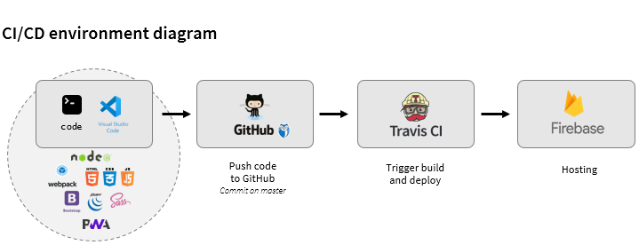

# Kilòmetre Solidari (static web)

**A web of Kilòmetre Solidari Project** :rocket:  
http://www.kilometresolidari.cat

Static web page. It built with webpack module bundler and it deploy in CI/CD environment using GitHub, Travis CI and Firbase cloud hosting.




---
 
## Technology

- HTML5/CSS3/JavaScript
- jQuery 1.12.4 (https://jquery.com)
- Bootstrap 3.3.7 (http://getbootstrap.com)
- Animate.css 3.5.2 (https://github.com/daneden/animate.css)
- Crazyload 1.3 (http://luis-almeida.github.com/unveil)
- Lightbox 2.9 (http://lokeshdhakar.com/projects/lightbox2)
- CountUp.js1.8.2 (https://inorganik.github.io/countUp.js)
- Highcharts 5.0.10 (https://www.highcharts.com)
- TimelineJS (https://timeline.knightlab.com)
- Awesome Font icons 4.7 (http://fontawesome.io/icons)
- ~~Google Maps (https://developers.google.com/maps)~~
- Leaflet Maps (https://leafletjs.com)
- OpenStreetMaps (https://www.openstreetmap.org)
- Google reCaptcha v2 (https://www.google.com/recaptcha/)
- Google Custom Search (https://developers.google.com/custom-search)
- Google Analytics (https://developers.google.com/analytics)

## Plugins
- Add This (https://www.addthis.com)
- Quantcast GDPR (https://www.quantcast.com/gdpr/consent-management-solution/)

## Function as a Services (FaaS)
- Google Firebase Realtime Database (https://firebase.google.com/docs/database/)

## Environment 
- NodeJS (https://nodejs.org/)
- Webpack (https://webpack.js.org/)
- Visual Studio Code (https://code.visualstudio.com/)
- GitHub (https://github.com/)
- TravisCI (https://travis-ci.com/)
- Google Firebase (https://console.firebase.google.com/)

## Tools and performance
- Web Manifest generator (https://app-manifest.firebaseapp.com)
- Fabicon generator (https://realfavicongenerator.net)
- Compress JPEG (http://www.compressjpeg.com)
- Google Cloud Platform (https://console.developers.google.com)
- Google Lighthouse Chrome audit (https://developers.google.com/web/tools/lighthouse)
- Google Page Speed (https://developers.google.com/speed/pagespeed/insights)
- Selenium ID (https://www.selenium.dev/selenium-ide)
- GitGuardian (https://app.gitguardian.com)

---

## Local configuration

### Add Git project to VSCode
1) Open VSCode
2) Go to menu option *View* > *Command Palette* > select *Git: clone*
3) Add https://github.com/jordisabadell/kilometresolidari-staticweb.git
4) Select destination local folder

### Set environment variables
Rename file *.env_EMTPY* to *.env* and set the following variables:
> APIKEYRECAPTCHA=  
> APIKEYFIREBASE=  
> APIKEYCUSTOMSEARCH=

### Install tools and dependencies

Install Webpack
```
npm install --global webpack webpack-cli
```
Install project dependencies
```
npm install
```
Build development mode
```
npm run builddev
```
Build production mode
```
npm run build
```
Build and start local server (it includes command 'build development mode'. See script line on package.json file for more information).
```
npm run start
```

---

## TravisCI configuration

### Generate Firebase token
```
firebase login:ci
```

### Shell script Git permisions
```
git update-index --chmod=+x build.sh
git commit -am "Update file permission"
```

### Set environment variables
Set the following *Environment Variables*:
> APIKEYRECAPTCHA  
> APIKEYFIREBASE  
> APIKEYCUSTOMSEARCH  
> FIREBASE_TOKEN

---

## Common commands

### Firebase: deploy
Install Firebase
```
npm install -g firebase-tools
```
Login and deploy
```
firebase login
firebase init
firebase deploy
```

### Git: pull
Download reporitory
```
git init
git remote add origin https://github.com/jordisabadell/kilometresolidari-staticweb
git pull origin master
```

### Git: commit and push
Commit change and push on master
```
git commit -m "Comment"
git push origin
```

### Git: discart changes
Reset
```
git fetch origin
git reset --hard origin/master
```

### Git: Remove sensitive data
Download BFG Repo-Cleaner and copy to {BFG_PATH}. I.e: 'c:\tmp'
https://rtyley.github.io/bfg-repo-cleaner/

Pull
```
git pull --rebase
```

Delete folders and files
```
java -jar {BFG_PATH}/bfg-1.13.0.jar --delete-folders "dist"
java -jar {BFG_PATH}/bfg-1.13.0.jar --delete-files ".env"
```

Update commits and tags
```
git reflog expire --expire=now --all && git gc --prune=now --aggressive
git filter-branch -f --prune-empty --tag-name-filter cat -- --all
```

Push
```
git push --force
```