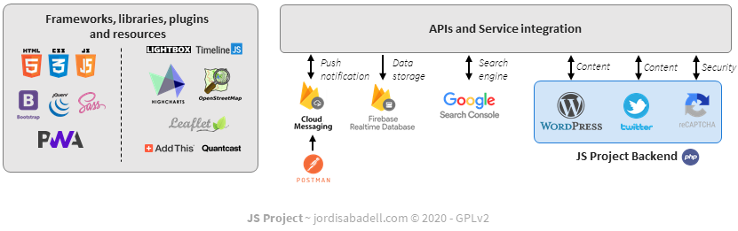

# Kilòmetre Solidari (static web)

**A web of Kilòmetre Solidari Project** :rocket:  
https://www.kilometresolidari.cat/esquitx

Static web page. It has been built with Webpack module bundler and it deploy in CI/CD environment using GitHub, Travis CI and Firebase cloud hosting.


**Technology description**



**Continuous integration /Continuous delivery (CI/CD)**


---
 
## Technology
HTML, CSS and Javascript.

### Frameworks, libraries, plugins and resources
- jQuery 3.4.1 (https://jquery.com)
- Bootstrap 4.4.1 (http://getbootstrap.com)
- Highcharts 5.0.10 (https://www.highcharts.com)
- TimelineJS (https://timeline.knightlab.com)
- Leaflet Maps (https://leafletjs.com)
- OpenStreetMaps (https://www.openstreetmap.org)
- Google reCaptcha (https://www.google.com/recaptcha/)
- Google Custom Search (https://developers.google.com/custom-search)
- Google Firebase Realtime Database (https://firebase.google.com/docs/database/)
- Google Analytics (https://developers.google.com/analytics)
- Animate.css 3.5.2 (https://github.com/daneden/animate.css)
- CountUp.js 1.8.2 (https://inorganik.github.io/countUp.js)
- Crazyload 1.3 (http://luis-almeida.github.com/unveil)
- Lightbox 2.9 (http://lokeshdhakar.com/projects/lightbox2)
- Add This (https://www.addthis.com)
- Quantcast GDPR (https://www.quantcast.com/gdpr/consent-management-solution/)
- Awesome Font icons 4.7 (http://fontawesome.io/icons)

## Environment 
- NodeJS (https://nodejs.org/)
- Webpack (https://webpack.js.org/)
- Visual Studio Code (https://code.visualstudio.com/)
- GitHub (https://github.com/)
- TravisCI (https://travis-ci.com/)
- Google Firebase hosting (https://console.firebase.google.com/)

## Tools and performance
- Web Manifest generator (https://app-manifest.firebaseapp.com)
- Fabicon generator (https://realfavicongenerator.net)
- Compress JPEG (http://www.compressjpeg.com)
- geojson.io Map editor (http://geojson.io)
- Google Cloud Platform (https://console.developers.google.com)
- Google Lighthouse Chrome audit (https://developers.google.com/web/tools/lighthouse)
- Google Page Speed (https://developers.google.com/speed/pagespeed/insights)
- Selenium ID (https://www.selenium.dev/selenium-ide)
- GitGuardian (https://app.gitguardian.com)

---

## Challenges
This static web has been created from the following challenges.

- [x] Create a PWA static web page.
- [x] Use module bundler. I started with Grunt, and then I migrated to Webpack (see previous Grunt project at [kilometresolidari-staticweb__deprecated](https://github.com/jordisabadell/kilometresolidari-staticweb__deprecated))
- [x] Create a stylesheet using Bootstrap and Sass language. I started with Bootstrap 3, and I updated the web to 4.
- [x] Use some third party plugins like Highcharts, TimelineJS :x:, Lightbox, AddThis :x: or Quantcast :x:.
- [x] Use some javascript efects like CountUp.js and Animate.css
- [x] Improve the load of the web using minify JS and css files, critical CSS :x: and lazy load techiques and performance tools (Google Lighthouse and Page Speed).
- [x] Find an alternative on Google Maps: it's Leaflet Maps and OpenStreetMaps. Load GeoJSON files. 
- [x] Load content from third party servers like custom Wordpress (via JSON API plugin, see at [/jordisabadell-wordpress](https://github.com/jordisabadell/jordisabadell-wordpress)), Twitter or Google Custom Search Engine.
- [x] Inject data, using functions as a services (FaaS), to Firebase Realtime Database.
- [x] Secure relational operations using a captcha. I started with Google reCaptcha v2 and then I migrate to v3 (see backend at [kilometresolidari-php-scripts](https://github.com/jordisabadell/kilometresolidari-php-scripts)).
- [x] Receive push notification from Firebase.
- [x] Automate tests using Selenium IDE.
- [x] Automate deploy from GitHub to Google Firebase cloud hosting. Using travis and preserve APIKEYs on GitHub, using GitGuardian.

---

## Local configuration

### Add Git project to VSCode
1) Open VSCode
2) Go to menu option *View* > *Command Palette* > select *Git: clone*
3) Add https://github.com/jordisabadell/kilometresolidari-staticweb.git
4) Select destination local folder

### Set environment variables
Rename file *.env_EMTPY* to *.env* and set the following variables:
> APIKEYRECAPTCHA=  
> APIKEYFIREBASE=  
> APIKEYCUSTOMSEARCH=

### Install tools and dependencies

Install Webpack
```
npm install --global webpack webpack-cli
```
Install project dependencies
```
npm install
```
Build development mode
```
npm run builddev
```
Build production mode
```
npm run build
```
Build and start local server (it includes command 'build development mode'. See script line on package.json file for more information).
```
npm run start
```

---

## TravisCI configuration

### Generate Firebase token
```
firebase login:ci
```

### Shell script Git permisions
```
git update-index --chmod=+x build.sh
git commit -am "Update file permission"
```

### Set environment variables
Set the following *Environment Variables*:
> APIKEYRECAPTCHA  
> APIKEYFIREBASE  
> APIKEYCUSTOMSEARCH  
> FIREBASE_TOKEN

---

## Common commands

### Firebase: deploy
Install Firebase
```
npm install -g firebase-tools
```
Login and deploy
```
firebase login
firebase init
firebase deploy
```

### Git: pull
Download reporitory
```
mkdir kilometresolidari-staticweb
cd kilometresolidari-staticweb
git init
git remote add origin https://github.com/jordisabadell/kilometresolidari-staticweb
git pull origin master
```

### Git: commit and push
Commit change and push on master
```
git add .
git commit -m "Your comment."
git push origin
```

### Git: discart changes
Reset
```
git fetch origin
git reset --hard origin/master
```

Undo last commit
```
git reset --hard HEAD~1
```

### Git: remove sensitive data
https://help.github.com/en/github/authenticating-to-github/removing-sensitive-data-from-a-repository

**Important:** The next git command will remove physically your file. Save your data before!

Remove file and file history:
```
git filter-branch --force --index-filter "git rm --cached --ignore-unmatch docs/diagrams.pptx" --prune-empty --tag-name-filter cat -- --all
```

Add file to **.gitignore**  

Push:
```
git push origin --force --all
git push origin --force --tags
```

Commit **.gitignore**:
```
git add .
git commit -m "Add *.pptx to gitignore"
git push origin master
```

---

## Send a test message using FCM
You will need:
- **Instance ID Token**: Token generated on your website through the *messaging.getToken()* function.

Steps:
1. Go to Firebase > Select project > Cloud Messaging > Send your first message.
1. Write "Notification" text filed.
1. Click on "Send test message".
1. Add a FCM registration token [your Instance ID Token].
1. Click on "Test".


## Send a test message using Postman

### 1. Get Access token
#### 1.1. Generate Private key
- Go to Firebase > Project settings > Service accounts > Generate new private key
- Rename file to "*private_key.json*" and move to *c:/tmp*

#### 1.2. Generate Access token (using Java)
Maven configuration:
```
<dependency>
  <groupId>com.google.api-client</groupId>
  <artifactId>google-api-client</artifactId>
  <version>1.25.0</version>
</dependency>
```
Java main class:
```
public static void main(String[] args) throws IOException {
  FileInputStream privateKeyFile = new FileInputStream("c:/tmp/private_key.json");

  //OAuth 2.0 Scopes for Google APIs --> https://developers.google.com/identity/protocols/oauth2/scopes#fcmv1
  String[] scopes = new String[] { 
    "https://www.googleapis.com/auth/cloud-platform"
  };

  GoogleCredential googleCredential = GoogleCredential
    .fromStream(privateKeyFile)
    .createScoped(Arrays.asList(scopes));

  googleCredential.refreshToken();

  String accessToken = googleCredential.getAccessToken();

  System.out.println(accessToken);
}
```
You'll get something like *ya29.c.Ko8Bx******FyD4OM*

### 2. HTTP POST request
You'll need:
- **Project ID**: Get you *+Project Id** going to Firebase > Project settings > General > Project ID.
- **Access token**: See previous step. 
- **Instance ID Token**: Token generated on your website through the *messaging.getToken()* function.

URL call:
```
POST https://fcm.googleapis.com/v1/projects/[Your Project ID]/messages:send HTTP/1.1
```

Headers:
```
Content-Type: application/json
Authorization: Bearer [your Access token]
```

Body (*raw* type):
```
{
  "message": {
    "token" : [your Instance ID Token],
    "notification": {
      "title": "Test message",
      "body": "This is a test message from FCM."
    },
    "webpush": {
      "fcm_options": {
        "link": "https://www.kilometresolidari.cat"
      }
    }
  }
}
```

## Subscribe user to a topic using Postman
You'll need:
- **Instance ID Token**: Token generated on your website through the *messaging.getToken()* function.
- **Topic name**: whatever you want.
- **Server key**: Firebase > Project settings > Cloud Messaging > Server key

URL call:
```
POST https://iid.googleapis.com/iid/v1/{your Instance ID token}/rel/topics/{Topic name} HTTP/1.1
```

Headers:
```
Content-Type: application/json
Authorization: key={your Server key}
```
## Send test messages to topic using Postman
Like example 'Send a test message using Postman'. You only have to replace 'token' by 'topic' on *Body* message :
```
{
  "message": {
    "topic" : [your Topic name],
    "notification": {
      "title": "Test topic",
      "body": "This is a test topic from FCM."
    }
  }
}
```